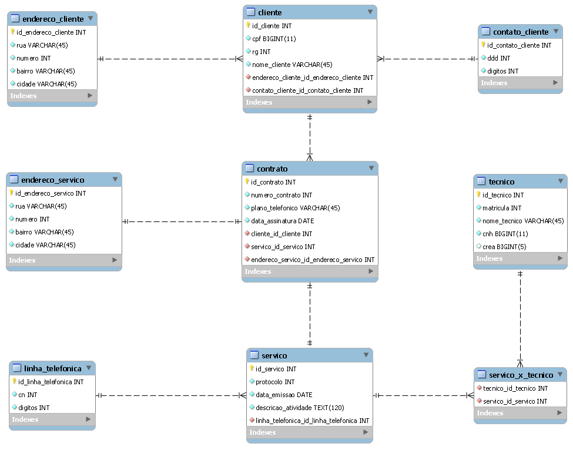

# Telecom Olá Mundo 

> Projeto de conclusão da disciplina Banco de Dados I no IFPE Recife.
Trata-se do planejamento e elaboração de um Banco de Dados (BD) para uma empresa fictícia de telefonia chamada Telecom Olá Mundo.

## Sobre a empresa

Telecom Olá Mundo é uma empresa pernambucana de telefonia fixa. Sua matriz fica na cidade do Recife com filiais em Caruaru e Arcoverde. Por ser uma prestadora de serviços telefônicos de médio porte, só atende clientes do estado de Pernambuco, próximos das localidades onde ficam a sede e as filiais. 
O cliente (CPF, RG, nome, endereço, contato) assina um contrato que possui um numero de identificação, o plano adquirido, a data em que foi assinado e o endereço onde o serviço será prestado. Cada contrato implica em um serviço que contém protocolo, data de emissão, a descrição da atividade e, claro, informações da linha telefônica que será instalada, removida ou ampliada no cliente.
Os técnicos são responsáveis por realizarem os serviços, podendo mais de um deles atuar na mesma atividade. Cada técnico deve portar a matricula da empresa, seu nome, numero da CNH e do registro do CREA.

## Pontos importantes

As localidades de Recife e Caruaru possuem código nacional 81, já as de Arcoverde possuem código nacional 87.

O endereço e número de contato de um cliente pode pertencer a outro que, eventualmente, resida no mesmo endereço e se utilize do mesmo numero de contato. Por exemplo, o número de contato pode ser um telefone fixo utilizado por todos na habitação.

O endereço do cliente não necessariamente é o endereço em que será realizado o serviço contratado, pois o mesmo pode solicitar o serviço para outras localidades por diferentes razões.

Linha telefônicas possuem apenas CN (código nacional) e o número para efetivar e receber chamadas, assim como estes mesmos campos são usados para registrar o contato dos clientes. 

Nem todos os técnicos possuem registro no CREA, mas todos possuem CNH para que possam usar carros da empresa e prover os serviços. Um técnico também pode atuar em mais de um protocolo de serviço.

## Modelo Relacional



## Script MySQL

Criação do BD.
```mysql
CREATE DATABASE ola_mundo_telecom;
```

Declaração de uso do BD a ser manipulado.
```mysql
USE ola_mundo_telecom;
/*Ou clique duas vezes sobre o nome do BD.*/
```

Criação das tabelas com seus respectivos campos.
```mysql
CREATE TABLE endereco_cliente(
id_endereco_cliente INT,
rua VARCHAR(45) NOT NULL,
numero INT NOT NULL,
bairro VARCHAR(45) NOT NULL,
cidade VARCHAR(45) NOT NULL,
PRIMARY KEY(id_endereco_cliente)
);

CREATE TABLE contato_cliente(
id_contato_cliente INT,
ddd INT NOT NULL,
digitos INT NOT NULL,
PRIMARY KEY(id_contato_cliente)
);

CREATE TABLE cliente(
id_cliente INT,
cpf BIGINT NOT NULL,
rg INT NOT NULL,
nome_cliente VARCHAR(45) NOT NULL,
id_endereco_cliente INT,
id_contato_cliente INT,
PRIMARY KEY(id_cliente),
FOREIGN KEY (id_endereco_cliente) REFERENCES endereco_cliente (id_endereco_cliente),
FOREIGN KEY (id_contato_cliente) REFERENCES contato_cliente (id_contato_cliente)
);

CREATE TABLE endereco_servico(
id_endereco_servico INT,
rua VARCHAR(45) NOT NULL,
numero INT NOT NULL,
bairro VARCHAR(45) NOT NULL,
cidade VARCHAR(45) NOT NULL,
PRIMARY KEY(id_endereco_servico)
);

CREATE TABLE tecnico(
id_tecnico INT,
matricula INT NOT NULL,
nome_tecnico VARCHAR(45) NOT NULL,
cnh BIGINT(11) UNIQUE NOT NULL, 
crea BIGINT(5) UNIQUE, 
PRIMARY KEY(id_tecnico)
);


CREATE TABLE linha_telefonica(
id_linha_telefonica INT,
cn INT NOT NULL,
digitos INT NOT NULL,
Tecnico_Matricula int,
PRIMARY KEY(id_linha_telefonica)
);

CREATE TABLE servico(
id_servico INT,
protocolo INT NOT NULL,
data_emissao DATE NOT NULL,
descricao_atividade TEXT(120) NOT NULL,
id_linha_telefonica INT,
PRIMARY KEY(id_servico),
FOREIGN KEY (id_linha_telefonica) REFERENCES linha_telefonica (id_linha_telefonica)
);

CREATE TABLE servico_x_tecnico(
id_tecnico INT,
id_servico int,
FOREIGN KEY (id_tecnico) REFERENCES tecnico (id_tecnico),
FOREIGN KEY (id_servico) REFERENCES servico (id_servico)
);

CREATE TABLE contrato(
id_contrato INT,
numero_contrato INT NOT NULL,
plano_telefonico VARCHAR(45) NOT NULL DEFAULT 'Ligação local',
data_assinatura DATE NOT NULL,
id_cliente INT,
id_servico INT,
id_endereco_servico INT,
PRIMARY KEY(id_contrato),
FOREIGN KEY (id_cliente) REFERENCES cliente (id_cliente),
FOREIGN KEY (id_servico) REFERENCES servico (id_servico),
FOREIGN KEY (id_endereco_servico) REFERENCES endereco_servico (id_endereco_servico)
);
```

Exclusão das tabelas.
```mysql
DROP TABLE servico_x_tecnico;
DROP TABLE tecnico;
DROP TABLE contrato;
DROP TABLE endereco_servico;
DROP TABLE servico;
DROP TABLE linha_telefonica;
DROP TABLE cliente;
DROP TABLE contato_cliente;
DROP TABLE endereco_cliente;
```

Exclusão do BD
```mysql
DROP DATABASE ola_mundo_telecom;
```
